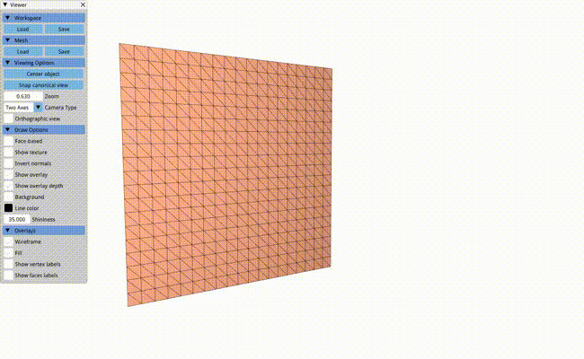

# FEM-Cloth-Simulation
Cloth simulation using co-rotational linear elasticity, this simulation will use triangles, rather than tetrahedron as the finite elements and will use a principal stretch-based model for the cloth material.

## Compilation for Testing

Compiling the code in the default manner will yield working, but very slow executables. To run the code at full speed, you should compile it in release mode. Starting in the **build directory**, do the following:

    cmake .. -DCMAKE_BUILD_TYPE=Release
    
Followed by:

    make 

## Execution

Once built, you can execute the assignment from inside the `build/` using 

    ./a4-cloth-simulation

While running, you can activate or de-activate the collision sphere by pressing `c`. 

